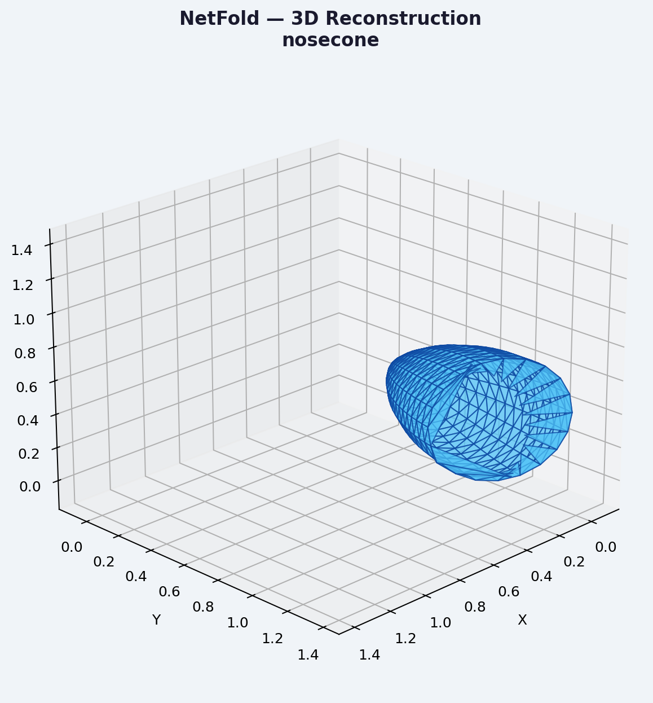
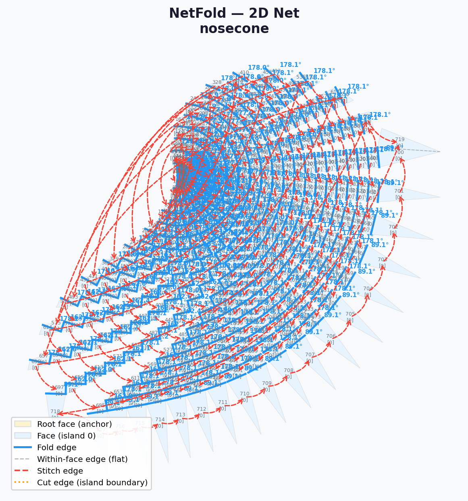

# NetFold: Physics-to-Fabrication Pipeline

**An end-to-end geometry encoding format for aerodynamically optimizing and directly manufacturing folded surfaces.**

NetFold takes complex 3D aerodynamic shapes, evaluates their fluid dynamics and manufacturing cost, and losslessly unwraps them into a flat 2D net—exporting machine-readable SVGs ready for industrial laser cutting and sheet-metal bending. 

It solves the fundamental geometric constraint of Gauss's Theorema Egregium by intelligently slicing compound curves into developable flat patches.



---

## 🚀 The Pipeline

```
[3D CAD Mesh]  ──►  [Aero Engine]  ──►  [NetFold]  ──►  [Laser Cutter SVG]
```

1. **Aero Engine (Physics):** Uses a 3D Source Panel Method to calculate pressure distributions, drag, and downforce over the car body.
2. **Structural Penalty (Weld Length):** NetFold calculates the exact linear distance of welding required to physically manufacture the aerodynamic shape, ensuring the Aero Engine never outputs an unbuildable design.
3. **Lossless Unwrapping:** Uses BFS traversal and SAT overlap detection to recursively unwrap and split the 3D geometry into flat 2D patches (islands).
4. **Machine-Readable Export:** Generates completely automated SVG cut files mapped to standard industrial protocols.

---

## 🏭 Advanced Fabrication Features

NetFold completely automates the translation from abstract 3D math into real-world shop floor instructions.



* **Planar Panel Fusion:** Automatically detects flat structural regions (like wings or sidepods) and fuses their geometry in the SVG. The 3D physics engine keeps its highly-dense triangle mesh for accurate fluid dynamics, while the laser cutter receives one solid, pristine sheet-metal polygon.
* **Physical Bending Math:** Calculates the true physical bending angle (`180° - dihedral`) from a flat metal sheet, eliminating translation errors for fabricators.
* **Smooth Curve Filtering:** Smart text-scaling filters out manufacturing labels for extremely shallow bends (`< 5°`), allowing aerodynamic surfaces to be cleanly slip-rolled without overlapping label instructions.
* **Multi-Island Sheet Freedom:** Complex non-convex geometry (like Formula Student nosecones) are dynamically split into separate, non-overlapping SVG files, giving teams the freedom to laser cut different patches from different sheets of metal.

---

## 📊 Format Stats (Demo Meshes)

NetFold serializes geometry into highly compressed binary (`.nfb`) or human-readable JSON (`.netfold`).

| Mesh | Triangles | Islands | Weld Length | OBJ Size | Binary Size |
|---|---|---|---|---|---|
| Cube | 12 | 1 | 7.8 units | 0.4 KB | **1.8 KB** |
| Icosahedron | 20 | 1 | 6.8 units | 0.6 KB | **2.2 KB** |
| Geodesic sphere | 320 | 1 | 23.7 units | 12.9 KB | **12.4 KB** |
| FS Nose cone | 720 | 1+ | 29.8 units | 21.0 KB | **27.8 KB** |

> *Binary format is comparable to raw OBJ size while encoding **full fold angle and stitch topology**.*

---

## 🛠️ Quick Start

```python
from core import encode_mesh_multi_island
from core.export_svg import export_svg
from core.aero_3d import run_3d_panel_method

# 1. Calculate Aerodynamics
# pressure_score = run_3d_panel_method("nose_cone.obj")

# 2. Encode Geometry & Calculate Manufacturing Cost
nf = encode_mesh_multi_island("nose_cone.obj", name="nose_cone")
weld_penalty = nf.calculate_weld_length()
print(f"Required welding: {weld_penalty:.2f} meters")

# 3. Export to Laser Cutter
saved_files = export_svg(nf, "nose_cone_pattern.svg")
print(f"Generated CNC patterns: {saved_files}")
```

## 🗺️ Roadmap

- [x] Export to SVG / DXF for CNC cutting
- [x] Advanced Fabrication Bending Math
- [x] Adaptive Planar Fusion
- [ ] Interactve web viewer (Three.js)
- [ ] Support for open meshes (with boundary)
- [ ] Optimal island layout (minimise bounding box area)
- [ ] Python package (`pip install netfold`)

---

## Author
Amulya — Built to bridge the gap between theoretical aerodynamic simulation and real-world sheet metal fabrication.
